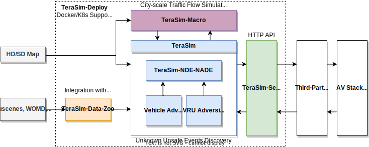

<div align="center">
<p align="center">


**Generative Autonomous Vehicle Testing Environment for Unknown Unsafe Events Discovery**

---

<a href="https://mcity.github.io/TeraSim">Website</a> •
<a href="https://mcity.github.io/TeraSim/docs">Docs</a> •
<a href="https://colab.research.google.com/github/mcity/TeraSim-examples/blob/master/examples/quickstart.ipynb">Try it Now</a> •
<a href="https://mcity.github.io/TeraSim/tutorials">Tutorials</a> •
<a href="https://github.com/mcity/TeraSim-examples">Examples</a> •
<a href="https://github.com/mcity/TeraSim/discussions">Community</a>

[](https://pypi.org/project/terasim)
[](https://pypi.org/project/terasim)
[](LICENSE)
[](https://github.com/mcity/TeraSim/issues)

</p>
</div>

## About

TeraSim is an **open-source traffic simulation platform** designed for **naturalistic and adversarial testing** of autonomous vehicles (AVs). It enables **high-speed, AI-driven testing environmetn generation** to expose AVs to both routine and **rare, high-risk driving conditions**.  

Developed with **researchers, AV developers, and regulators** in mind, TeraSim is designed to better support **ISO 21448 (SOTIF) and ISO 34502 compliance**, providing a **scalable, automated, and unbiased AV evaluation framework**.


<!-- ## **🎥 Demo Video**

https://github.com/mcity/TeraSim/docs/videos/TeraSim_demo.mp4 -->

TeraSim is built upon a series of foundational academic works in autonomous vehicle testing:

- **NDE** ([Paper](https://doi.org/10.1038/s41467-023-37677-5) | [Code](https://github.com/michigan-traffic-lab/Learning-Naturalistic-Driving-Environment)): Learning naturalistic driving environment with statistical realism. *Yan, X., Zou, Z., Feng, S., et al. Nature Communications 14, 2037 (2023).*

- **NADE** ([Paper](https://doi.org/10.1038/s41467-021-21007-8) | [Code](https://github.com/michigan-traffic-lab/Naturalistic-and-Adversarial-Driving-Environment)): Intelligent driving intelligence test for autonomous vehicles with naturalistic and adversarial environment. *Feng, S., Yan, X., Sun, H. et al. Nature Communications 12, 748 (2021).*

- **D2RL** ([Paper](https://doi.org/10.1038/s41586-023-05732-2) | [Code](https://github.com/michigan-traffic-lab/Dense-Deep-Reinforcement-Learning)): Dense reinforcement learning for safety validation of autonomous vehicles. *Feng, S., Sun, H., Yan, X., et al. Nature 615, 620–627 (2023).*

---

## **🌟 Key Features**  
✅ **Generative Driving Environment Testing**  
→ **Adaptive and interactive** environments replace static, manually designed scenarios.  
→ **Automatically uncovers unknown unsafe events**, enhancing AV safety validation.  
→ **Scalable and efficient**, reducing manual effort while expanding test coverage.

✅ **Naturalistic & Adversarial Driving Environments (NADE)**  
→ Real-world traffic behavior modeling based on **large-scale naturalistic driving data**.  
→ Injects **corner cases** (e.g., jaywalking pedestrians, sudden lane changes) to rigorously test AV safety.  

✅ **Scalable & Automated AV Testing**  
→ AI-driven **naturalistic and adversarial driving environment** accelerates AV validation **by 1,000x - 100,000x** compared to real-world testing.  
→ Dynamically adapts test cases to **urban, highway, and mixed-traffic conditions**.  

✅ **Seamless Integration with Third-Party Simulators**  
→ Works with **CARLA, Autoware**, and more.  
→ API-driven design enables **plug-and-play simulation** for integration with third-party simulators.  

✅ **City-Scale AV Testing with TeraSim-Macro**  
→ Extends simulations from **single intersections to entire cities**, supporting **policy-level AV impact analysis**.  

✅ **Multimodal Inputs & AI-Assisted Environment Creation**  
→ TeraSim-GPT enables **language-driven environment customization**.  
→ Define test cases in natural language: *"Create a left-turn driving environment at a busy intersection."*  

---

## **🛠️ System Architecture**  

TeraSim is modular, allowing users to **customize and extend** simulations easily. 




📌 **Core Components:**  
- **[TeraSim](https://github.com/mcity/TeraSim):** Base simulation engine for generating AV test environments.  
- **[TeraSim-NDE-NADE](https://github.com/mcity/TeraSim-NDE-NADE):** Realistic & adversarial driving environments for safety evaluation.  
  - **Vehicle Adversities** (e.g., aggressive cut-ins, emergency braking).  
  - **VRU Adversities** (e.g., jaywalking pedestrians, erratic cyclists).  
- **[TeraSim-Macro](https://github.com/mcity/TeraSim-Macro):** Enables **mesoscopic city-scale AV testing**.  
- **[TeraSim-Service](https://github.com/mcity/TeraSim-Service):** Middleware for integrating **third-party simulators (CARLA, AWSim, etc.)**.  
- **[TeraSim-Data-Zoo](https://github.com/mcity/TeraSim-Data-Zoo):** Repository for **real-world driving data (Waymo, NuScenes, NuPlan)**.  
- **[TeraSim-GPT](https://github.com/mcity/TeraSim-GPT):** AI-powered **multimodal user input handling** for environment customization.  

📌 **Plug-and-Play Compatibility:**  
✅ SUMO-based microsimulation  
✅ CARLA & Autoware integration  
✅ Real-world dataset support  

---

## **🔧 Installation**  

TeraSim can be installed via **pip** for quick setup:  
```bash
pip install terasim
```
For a more detailed installation guide, refer to the **[Installation Section](#installation)**.

---

## **🚀 Why TeraSim?**  

🔍 **Uncover Hidden AV Risks**  
→ Dynamically generates realistic and adversarial traffic environments, identifying **corner cases**.  

⚡ **Automated & Scalable**  
→ Uses AI to generate simulations across cities, with **1000x faster testing efficiency** than real-world methods.  

🔗 **Seamless Integration**  
→ Plugin-based design works with **existing AV stacks & third-party simulators**.  

📢 **Open-Source & Extensible**  
→ Encourages industry collaboration for **safer, more reliable AV deployment**.  

---

## **📌 Next Steps**
- Read the **[Quick Start Guide](#quick-start-guide)**.  
- Try a **[Basic Simulation](#basic-simulation-example)**.  
- Join our **[Community Discussions](https://github.com/michigan-traffic-lab/TeraSim/discussions)**. 
