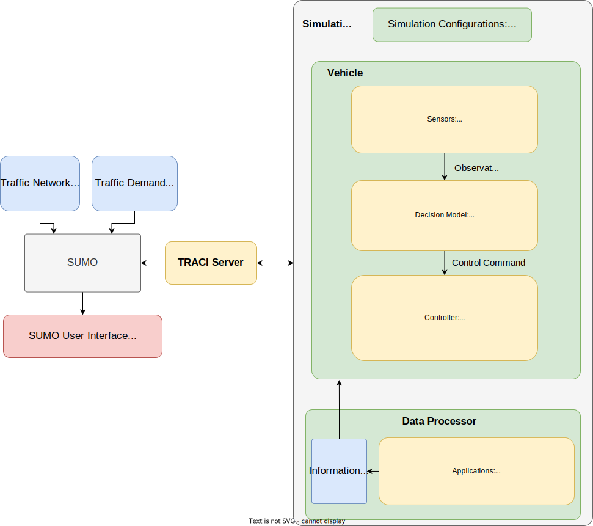

<!-- PROJECT LOGO -->
<p align="center">
  <h3 align="center">Michigan Traffic Lab Simulation Platform</h3>
  <p align="center">
    An autonomous vehicle testing and training platform based on SUMO
    <br />
    <a href="https://github.com/michigan-traffic-lab/MTL-Simulation-Platform">View Demo</a>
    ·
    <a href="https://github.com/michigan-traffic-lab/MTL-Simulation-Platform/issues">Report Bug</a>
    ·
    <a href="https://github.com/michigan-traffic-lab/MTL-Simulation-Platform/issues">Request Feature</a>
  </p>
</p>


<!-- ABOUT THE PROJECT -->
# Introduction

## About
This project aims at providing a microsim simulation environment based on SUMO. With APIs provided, users can easily build vehicle model and apply test on the simulation platform.

## Code Structure

- docs: extra documentations on this repo
- examples: examples of using mtlsp to run driving simulations of vehicle models
- mtlsp: main contents
  - envs: uses functions from 'vehicle' and create an integrated driving environment with multiple vehicles in which the given autonomous vehicles are tested
  - logger: tracks the information in the environment
  - measure: measures to take along with simulations
  - network: transforms the maps to SUMO API to be used by simulator
  - vehicle: contains the 'sensors', 'controllers' and 'decision_models' of a vehicle, and uses 'factories' to combine all three parts and creat a vehicle.
  - configs.py: contains configurations
  - simulator.py: applies SUMO to our environment and run simulations
  - utils.py: utility functions
- setup.py: required packages to run this repo


<!-- GETTING STARTED -->

# Installation
The project is developed and tested on Ubuntu 22.04 LTS. Therefore, we recommend running the following process on Ubuntu 22.04 LTS. You are recommended to create a virtual environment to install the simulation platform.

## Prerequisites

Recommended environment:
- Python 3.8
- SUMO 1.16

Minimum versioned environment:
- Python 3.8
- SUMO 1.8

We recoomend using Conda to create a virtual environment and install the MTLSP.
```
conda create -n $env_name$ python=3.8
conda activate $env_name$
```

The simulation requires map files in SUMO format (.net.xml). Please refer to '/examples' for detailed guidelines.

## Install SUMO

We recommend using pip to install SUMO and SUMO-Tools for simplicity. Please run the following commands:

```
pip install eclipse-sumo traci libsumo sumolib
```

Additionally, you can also install SUMO and SUMO-Tools using the pre-built binaries or build from source. Please refer to [SUMO](https://sumo.dlr.de/docs/Installing.html) for detailed instructions.

## Download mtlsp
- Download from Github: `git clone https://github.com/michigan-traffic-lab/MTL-Simulation-Platform.git`

## Install mtlsp
Navigate to the directory of the project (`cd MTL-Simulation-Platform`), and then

- Normal install: `pip install .`
- Development install: `pip install -e .`

<!-- USAGE EXAMPLES -->
# Usage

The package consists of multiple classes, including simulator, environment, vehicle and controller. for basic usage, we only need the Simulator class and the Environment class. For example, to build a simulation with one dummy AV running in a 3lane highway, we neeed the following script:

```python
from mtlsp.simulator import Simulator
from mtlsp.envs.env import BaseEnv
from mtlsp.logger.infoextractor import InfoExtractor
import mtlsp.vehicle
from mtlsp.vehicle.factories.dummy_vehicle_factory import DummyVehicleFactory
from mtlsp.vehicle.sensors.local_sensor import LocalSensor
from mtlsp.vehicle.controllers.high_efficiency_controller import HighEfficiencyController
from mtlsp.vehicle.vehicle import Vehicle
from mtlsp.vehicle.decision_models.dummy_decision_model import DummyDecisionModel
from mtlsp.vehicle.decision_models.idm_model import IDMModel


class ExampleVehicleFactory(DummyVehicleFactory):

    def create_vehicle(self, veh_id, simulator):
        """Generate a vehicle with the given vehicle id in the simulator, composed of a decision model, a controller, and a list of sensors, which should be defined or customized by the user.

        Args:
            veh_id (_type_): vehicle id
            simulator (_type_): simulator (sumo)

        Returns:
            Vehicle: the contructed vehicle object
        """
        sensor_list = [LocalSensor(simulator)]
        # decision_model = DummyDecisionModel(mode="random")  # mode="random" "constant"
        decision_model = IDMModel() # Use IDM model to control the vehicles
        control_params = {
            "v_high": 40,
            "v_low": 20,
            "acc_duration": 0.1,  # the acceleration duration will be 0.1 second
            "lc_duration": 1,  # the lane change duration will be 1 second
        }
        controller = HighEfficiencyController(simulator, control_params)
        return Vehicle(veh_id, simulator, sensors=sensor_list,
                       decision_model=decision_model, controller=controller)

env = BaseEnv(
    vehicle_factory = ExampleVehicleFactory(),
    info_extractor=InfoExtractor
)
sim = Simulator(
    sumo_net_file_path = 'examples/maps/3LaneHighway/3LaneHighway.net.xml',
    sumo_config_file_path = 'examples/maps/3LaneHighway/3LaneHighway.sumocfg',
    num_tries=10,
    gui_flag=False,
    output_path="./output/0",
    sumo_output_file_types=["fcd_all"],
)
sim.bind_env(env)
sim.run()

```

In the script, we build the environment, the simulator, and bind them together. Then we run the simulator, the sumo interface will show up. After clicking the "run" button in the sumo-gui, the simulation will run with one autonomous vehicle(CAV) and multiple background vehicles(BVs).

<!-- CONTRIBUTING -->
# Contributing

Contributions are what make the open source community such an amazing place to be learn, inspire, and create. Any contributions you make are **greatly appreciated**.

1. Fork the Project
2. Create your Feature Branch (`git checkout -b feature/AmazingFeature`)
3. Commit your Changes (`git commit -m 'Add some AmazingFeature'`)
4. Push to the Branch (`git push origin feature/AmazingFeature`)
5. Open a Pull Request

# Credits

## Developer

Haowei Sun: haoweis@umich.edu
Haojie Zhu: zhuhj@umich.edu

## Reviewer

Haojie Zhu: zhuhj@umich.edu

## License

Distributed under the MIT License.

## Contact

- Haowei Sun - haoweis@umich.edu - Michigan Traffic Lab
- Haojie Zhu - zhuhj@umich.edu - Michigan Traffic Lab
- Shuo Feng - fshuo@umich.edu - Michigan Traffic Lab
- Henry Liu - henryliu@umich.edu - Michigan Traffic Lab

Project Link: [https://github.com/michigan-traffic-lab/MTL-Simulation-Platform](https://github.com/michigan-traffic-lab/MTL-Simulation-Platform)
