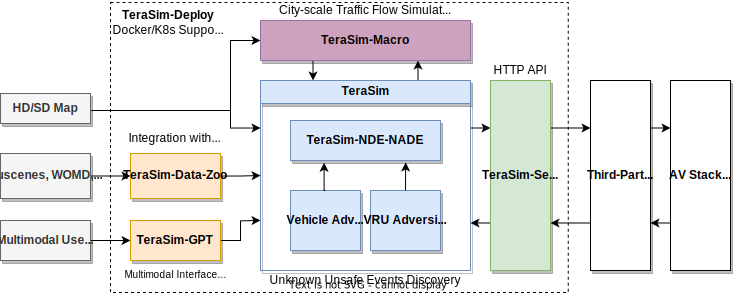

<!-- PROJECT LOGO -->
<p align="center">
  <h3 align="center">TeraSim</h3>
  <p align="center">
    An autonomous vehicle testing and training platform based on SUMO
    <br />
    <a href="https://github.com/michigan-traffic-lab/TeraSim">View Demo</a>
    ·
    <a href="https://github.com/michigan-traffic-lab/TeraSim/issues">Report Bug</a>
    ·
    <a href="https://github.com/michigan-traffic-lab/TeraSim/issues">Request Feature</a>
  </p>
</p>


<!-- ABOUT THE PROJECT -->
# Introduction

### **🚀 TeraSim: Next-Generation Autonomous Vehicle Testing**  

TeraSim is an **open-source traffic simulation platform** designed for **naturalistic and adversarial testing** of autonomous vehicles (AVs). It enables **high-speed, AI-driven testing environmetn generation** to expose AVs to both routine and **rare, high-risk driving conditions**.  

Developed with **researchers, OEMs, and regulators** in mind, TeraSim supports **ISO 21448 (SOTIF) and ISO 34502 compliance**, providing a **scalable, automated, and unbiased AV evaluation framework**.

---

## **🌟 Key Features**  

✅ **Naturalistic & Adversarial Driving Environments (NADE)**  
→ Real-world traffic behavior modeling based on **large-scale naturalistic driving data**.  
→ Injects **corner cases** (e.g., jaywalking pedestrians, sudden lane changes) to rigorously test AV safety.  

✅ **Scalable & Automated AV Testing**  
→ AI-driven **naturalistic and adversarial driving environment** accelerates AV validation **by 1,000x - 100,000x** compared to real-world testing.  
→ Dynamically adapts test cases to **urban, highway, and mixed-traffic conditions**.  

✅ **Seamless Integration with Third-Party Simulators**  
→ Works with **CARLA, Autoware, NVIDIA Cosmos**, and more.  
→ API-driven design enables **plug-and-play simulation** for existing AV stacks.  

✅ **City-Scale AV Testing with TeraSim-Macro**  
→ Extends simulations from **single intersections to entire cities**, supporting **policy-level AV impact analysis**.  

✅ **Multimodal Inputs & AI-Assisted Environment Creation**  
→ TeraSim-GPT enables **language-driven environment customization**.  
→ Define test cases in natural language: *“Create a left-turn collision scenario at a busy intersection.”*  

---

## **🛠️ System Architecture**  

TeraSim is modular, allowing users to **customize and extend** simulations easily. 


📌 **Core Components:**  
- **TeraSim:** Base simulation engine for generating AV test environments.  
- **TeraSim-NADE:** Realistic & adversarial driving environments for safety evaluation.  
  - **Vehicle Adversities** (e.g., aggressive cut-ins, emergency braking).  
  - **VRU Adversities** (e.g., jaywalking pedestrians, erratic cyclists).  
- **TeraSim-Macro:** Enables **mesoscopic city-scale AV testing**.  
- **TeraSim-Service:** Middleware for integrating **third-party simulators (CARLA, AWSim, etc.)**.  
- **TeraSim-Data-Zoo:** Repository for **real-world driving data (Waymo, NuScenes, NuPlan)**.  
- **TeraSim-GPT:** AI-powered **multimodal user input handling** for scenario customization.  

📌 **Plug-and-Play Compatibility:**  
✅ SUMO-based microsimulation  
✅ CARLA & Autoware integration  
✅ Real-world dataset support  

---

## **🔧 Installation**  

TeraSim can be installed via **pip** for quick setup:  
```bash
pip install terasim
```
For a more detailed installation guide, refer to the **[Installation Section](#installation)**.

---

## **🚀 Why TeraSim?**  

🔍 **Uncover Hidden AV Risks**  
→ Dynamically generates realistic and adversarial traffic environments, identifying **edge cases**.  

⚡ **Automated & Scalable**  
→ Uses AI to generate simulations across cities, with **1000x faster testing efficiency** than real-world methods.  

🔗 **Seamless Integration**  
→ Plugin-based design works with **existing AV stacks & third-party simulators**.  

📢 **Open-Source & Extensible**  
→ Encourages industry collaboration for **safer, more reliable AV deployment**.  

---

## **📌 Next Steps**
- Read the **[Quick Start Guide](#quick-start-guide)**.  
- Try a **[Basic Simulation](#basic-simulation-example)**.  
- Join our **[Community Discussions](https://github.com/michigan-traffic-lab/TeraSim/discussions)**. 
